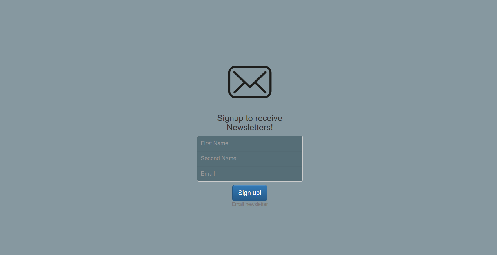

# Email_Newsletter

## Description

This project utilizes the Mailchimp API and Node.js to facilitate the sending of newsletters via email. The application is built using HTML, CSS, and JavaScript.

## Configuration

In the `app.js` file, update the following variables with your Mailchimp API credentials:

```javascript
const usServer = "YOUR_SERVER";
const listId = "YOUR_LIST_ID";
const user = "YOUR_USERNAME";
const apiKey = "YOUR_API_KEY";
```

## Installation

To install the necessary dependencies, run the following command in your terminal:

```bash
npm i
```

## Usage

Run the application using the following command:

```bash
node app.js
```

## Languages Used


## Demo


